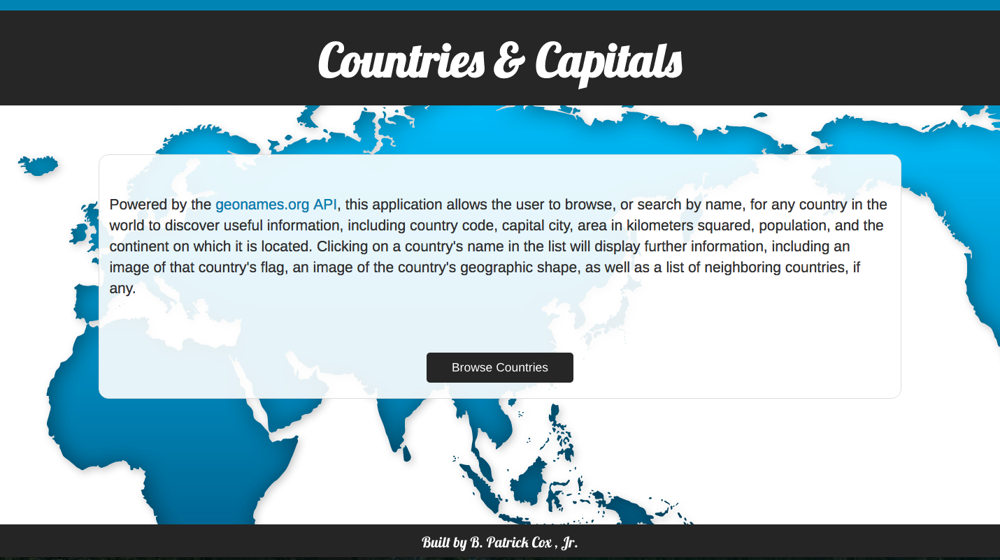

The Countries and Capitals app utiilizes the geonames.org API, allowing the user to browse, or search by name, for any country in the world to discover useful information, including country code, capital city, area in kilometers squared, population, the continent on which the country is located, and even its neighboring countries, if any.  It also displays an image of the country's flag, and a simple image of the country's border.

The live project can be found here: bpcoxjr.github.io/countries-and-capitals/app/#/home.

